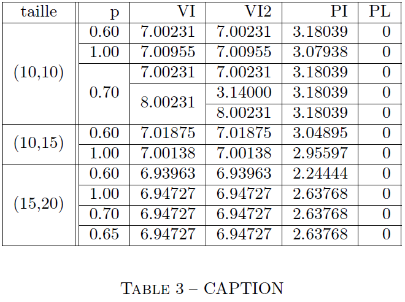

# Latex-tables
 This project is made as an hobby. It's entirely made in python 2.7.
 It's all about transforming data files in the format of
 `[VALUES[\t| ]*]\n`
 into a LaTeX table. The first line of data is the name of the columns. It's using the *multirow* package as needed by the data.

 Please use the *-h* option to get help. Feel free to try on the *test* data.

    usage: table.py [-h] [-c N] [-t [T]] [-s savePath] path

    Generating Latex multirow from file

    positional arguments:
      path                  path to data

    optional arguments:
      -h, --help            show this help message and exit
      -c N, --columns N     the first N columns which you want to make multirows
                            with, by default all.
      -t [T], --truncate [T]
                            truncate to T values after the decimal point, by
                            default automatic formating to minimal number of zeros
      -s savePath, --save savePath
                            to save the table in a file at savePath, turns the
                            program silent

    Don't forget to \usepackage{multirow}

the test data returns this table using the *-t* option

